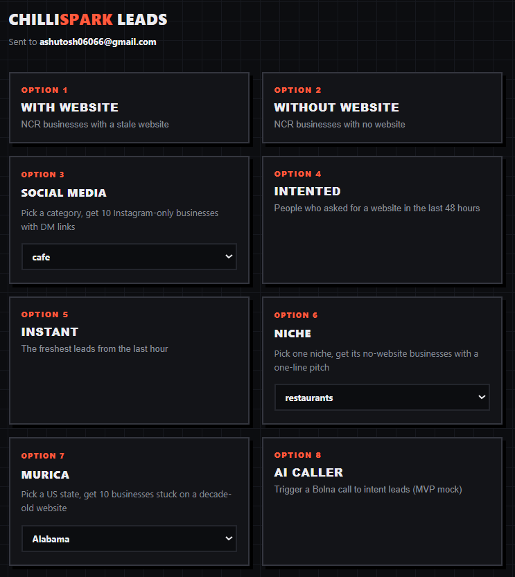

# AI Lead Gen

Centralized hub for all AI-driven lead generation, scraping, qualification, and automated outbound outreach pipelines. 
The `launcher` orchestrates the different sub-tools directly.

## 🏗️ Product Architecture

```text
                        ┌─────────────────────────────────────────────────────┐
                        │                    AIGEN LAUNCHER                   │
                        │         (Local Web UI - FastAPI/SimpleHTTP)         │
                        └─────────┬───────────────────────┬───────────────────┘
                                  │                       │
           ┌──────────────────────┼───────────────────────┼────────────────────┐
           ▼                      ▼                       ▼                    ▼
  ┌─────────────────┐    ┌────────────────┐     ┌──────────────────┐    ┌───────────────┐
  │  Data Scrapers  │    │  Social Media  │     │ Intent & Niche   │    │  AI Caller    │
  │ (data-analysis) │    │   (scraper3)   │     │ (leeds, Niche,   │    │ (ai-caller)   │
  │                 │    │                │     │  murica)         │    │               │
  │ • Website Audits│    │ • Instagram    │     │ • Reddit/Forums  │    │ • Voice API   │
  │ • Contact Info  │    │ • DM Linking   │     │ • Older websites │    │ • Voice Agent │
  └────────┬────────┘    └────────┬───────┘     └─────────┬────────┘    └──────┬────────┘
           │                      │                       │                    │
           └──────────────────────┼───────────────────────┘                    ▼
                                  ▼                                   ┌───────────────┐
                        ┌──────────────────┐                          │ User Automated│
                        │  Master Ledgers  │                          │     Call      │
                        │ (.xlsx / .json)  │                          └───────────────┘
                        └─────────┬────────┘                                   
                                  │                                            
                                  ▼                                            
                        ┌──────────────────┐                                   
                        │ Email Automation │                                   
                        │                  │                                   
                        │ • Drafts Pitches │                                   
                        │ • Formats Leads  │                                   
                        └─────────┬────────┘                                   
                                  │                                            
                                  ▼                                            
                         ┌────────────────┐                                    
                         │    Mailer      │                                    
                         │ (Resend API)   │                                    
                         └────────────────┘                                    
```

## ⚙️ Tech Stack
- **Backend/Scripts**: Python 3
- **Web UI**: HTML/CSS + JS with a Python simple HTTP server backend
- **Scraping**: `httpx`, `BeautifulSoup`, custom proxy rotators
- **Automation**: Subprocesses orchestrating different isolated virtual environments
- **Voice AI**: Voice API
- **Email Delivery**: Resend API
- **Data Storage**: Excel (`openpyxl`), JSON flat files (`seen.json`)

## 🔄 Workflow Diagram

```text
[1] User opens Launcher Web UI on Localhost
 │
 ├─► [2] Selects a Target (e.g., "Niche", "Murica", "AI Caller")
 │
 ├─► [3] Launcher spawns a background Python Subprocess 
 │       running the specific tool in its own isolated `.venv`
 │
 ├─► [4] Tool performs scraping/API calls 
 │       (Searches Google Maps, Reddit, or triggers Voice Agents)
 │
 ├─► [5] Tool writes findings to the unified `leads_master.xlsx`
 │       or specific `out/` temp files.
 │
 ├─► [6] Email Automation picks up the new leads,
 │       uses GenAI to craft personalized 1-liner pitches.
 │
 └─► [7] Resulting sheet is emailed to you via Resend for manual review.
```

## 🚀 Running Locally

To run this locally as a monorepo, simply launch the server:

```bash
cd launcher
.\start.bat
```
(If `start.bat` is not working because of missing environments, ensure you have set up the `.venv` in the `german` folder first, as the launcher uses its Python executable).

## Screenshots


